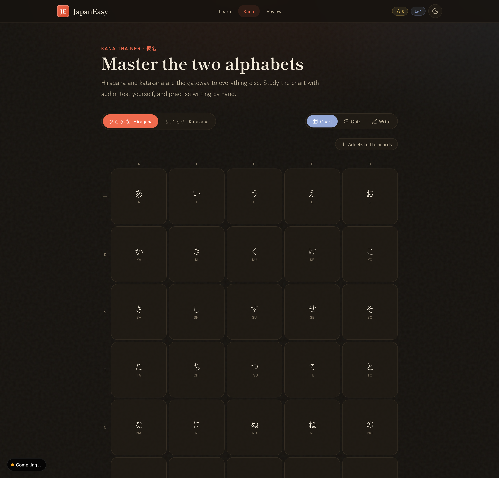
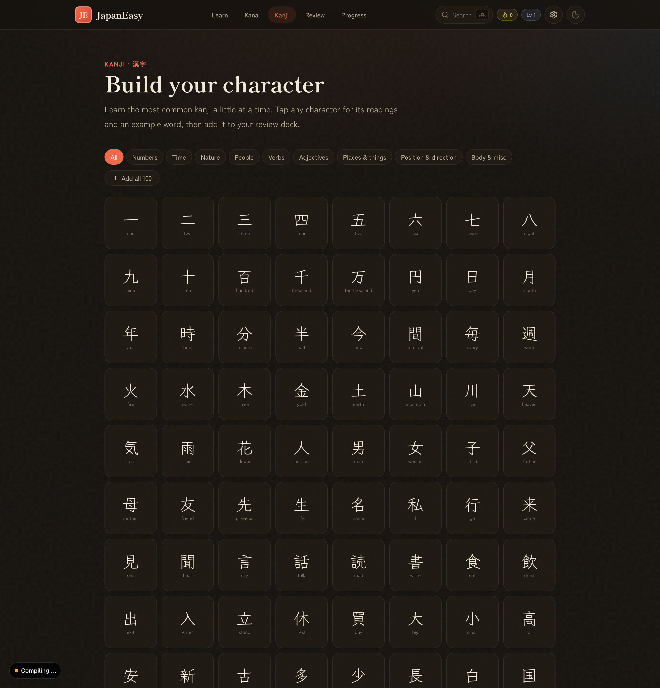
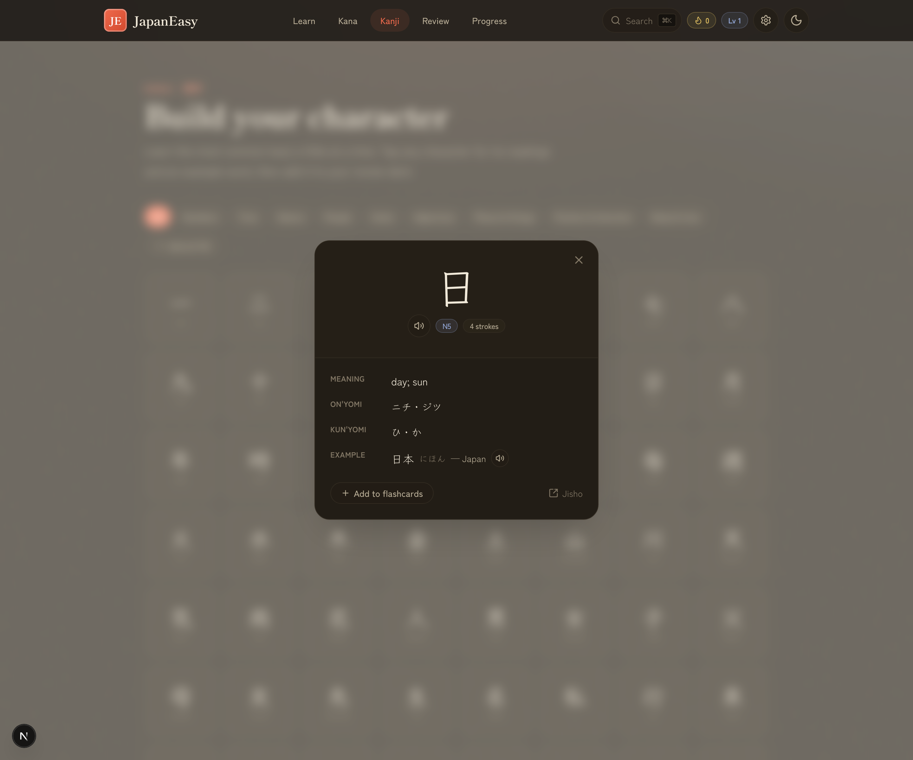
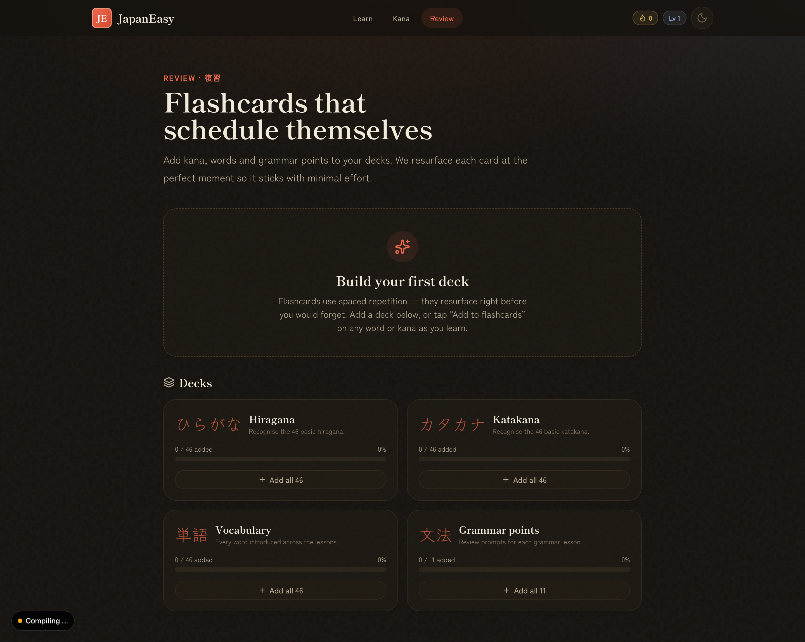
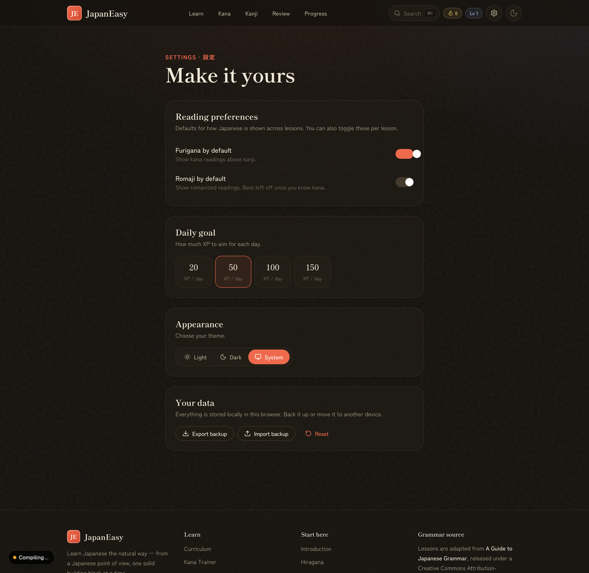

# JapanEasy 🇯🇵

**Learn Japanese the natural way** — a calm, structured course that teaches Japanese from a Japanese point of view, with the interactive tools that make learning stick.

JapanEasy is a lesson-based web app: kana first, then grammar built block by block, with spaced-repetition flashcards, audio on every sentence, quizzes, kanji browse, and a streak/XP system. Everything runs in the browser — **no account, no backend**. Progress saves privately in `localStorage`.

---

## Screenshots

| Home & dashboard | Curriculum |
| --- | --- |
|  |  |

| Kana trainer | Kanji browser |
| --- | --- |
|  |  |

| Kanji detail | Flashcards (SRS) |
| --- | --- |
|  |  |

| Progress | Settings |
| --- | --- |
|  |  |

---

## Features

- **73 lessons across 6 stages** — Writing System → N5 → N4 → N3 → N2 → N1, a JLPT-aligned spiral curriculum with recurring real-life themes
- **A complete learning loop** — first-run onboarding, guided *learn the words* mode around each lesson, a skippable pre-lesson warm-up of due reviews, and quiz misses feeding straight back into the review queue
- **Spaced-repetition flashcards** — SM-2-style scheduler with typed recall (romaji converts live); kana, vocab, kanji, and grammar decks, plus focused practice for struggling cards
- **327 grammar pattern drills** — every grammar lesson drills its own patterns (conjugate, fill the particle, transform), not title→summary cards
- **Kanji browser & dual cards** — 172 common characters; each adds a recall *and* a recognition card, revealed with an example word
- **Per-lesson quizzes** — multiple choice, fill-in, matching, sentence-building, and listening dictation; 80%+ completes the lesson
- **Kana Trainer** — hiragana/katakana chart, recognition quiz, and writing canvas
- **Audio everywhere** — Web Speech API on sentences, words, and kana (curated audio planned)
- **Furigana & romaji toggles** — romaji off by default; generated from kana automatically
- **Global search (⌘K)** — jump to any lesson, word, kanji, or page
- **Honest progress** — streaks, XP, a daily goal counted in reviews or lessons (not XP grinding), study heatmap, export/import
- **Light & dark themes** — clean, high-contrast UI

See **[ROADMAP.md](ROADMAP.md)** for direction and what's next.

## Tech stack

- [Next.js 16](https://nextjs.org/) (App Router) + React 19 + TypeScript
- [Tailwind CSS v4](https://tailwindcss.com/)
- [Zustand](https://github.com/pmndrs/zustand) + `localStorage` persistence
- [lucide-react](https://lucide.dev/) · [motion](https://motion.dev/)
- Web Speech API for pronunciation

## Getting started

**Prerequisites:** Node.js 20+ and npm.

```bash
npm install
npm run dev      # http://localhost:3000
```

```bash
npm run build    # production build + type-check
npm run start    # serve production build
npm run lint
npm test         # vitest — srs, japanese text, answer checkers, store, content scans
```

> Japanese TTS depends on your OS/browser voice. Audio buttons hide themselves if none is available.

## Project structure

```text
app/                     # routes (home, learn, lessons, kana, kanji, flashcards, progress, settings)
content/                 # typed lesson & kanji data
  lessons/               # one file per lesson + index.ts registry
  curriculum.ts          # stage metadata
  kana.ts, kanji.ts, decks.ts, types.ts
lib/                     # store, SRS, furigana/romaji, speech, leveling
components/              # UI by feature area
tests/                   # vitest suites incl. content validation
.screenshots/            # README screenshots
```

## How it works

- **Content is typed TypeScript**, not Markdown — furigana, audio, quizzes, and flashcards are derived from each `Lesson` object ([`content/types.ts`](content/types.ts)).
- **Furigana convention:** `学生[がくせい]だ` → ruby rendering + auto romaji.
- **Progress** lives in `localStorage` (`japaneasy-store-v1`). Reset via the footer link or Settings → data controls.

See **[AUTHORING.md](AUTHORING.md)** for adding or editing lessons.

## Deploy

Works on [Vercel](https://vercel.com/) or any static host that supports Next.js:

```bash
npm run build
```

Connect the repo, set framework to Next.js, deploy. No environment variables required.

## Source & attribution

Grammar is organized as an original **JLPT-aligned spiral curriculum** (Writing System → N5–N1) with recurring real-life themes. Early drafts drew structural inspiration from ***A Guide to Japanese Grammar*** by Tae Kim; lesson prose and examples are original. JapanEasy is a non-commercial learning project.

Kana stroke-order data (`content/kana-strokes.ts`) comes from [KanjiVG](https://kanjivg.tagaini.net) by Ulrich Apel (CC BY-SA 3.0), regenerated with `node scripts/fetch-kana-strokes.mjs`.
